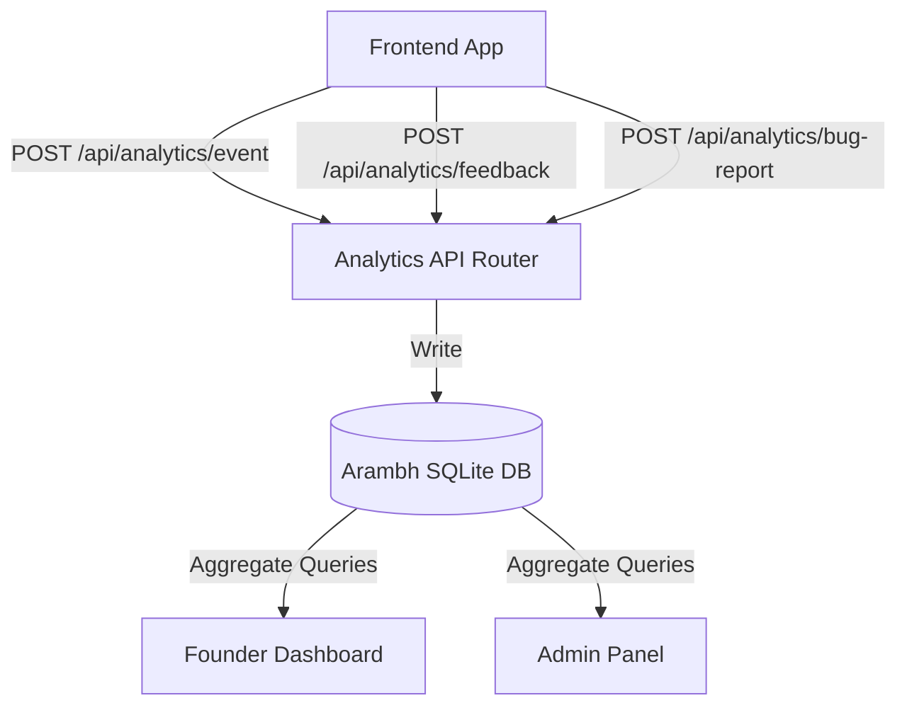

# Arambh Beta Readiness Report

This report summarizes the telemetry implementation, admin controls, and operational infrastructure prepared for the Arambh Beta Program (20-50 active users). All tracking components, feedback mechanisms, and audit pipelines are live and verified.

---

## 1. Analytics & Telemetry Layer Architecture

A custom, low-overhead analytics subsystem has been implemented to measure user engagement, learning friction, and retention without reliance on heavy third-party platforms.



### Database Schema Definition
Three dedicated database tables are registered in the SQLAlchemy metadata:
1. **`AnalyticsEvent`**: Logs individual user telemetry.
   * `id`: Primary key.
   * `user_id`: Foreign key reference to the user.
   * `event_type`: Category of the action (e.g., `login`, `lesson_start`, `lesson_complete`, `boss_attempt`).
   * `details`: Serialized JSON string containing key-value data snapshots.
   * `created_at`: Datetime stamp of occurrence.
2. **`LessonFeedback`**: Captures micro-opinions on curriculum clarity.
   * `id`, `user_id`, `region_id`, `lesson_id`, `helpful` (Boolean), `created_at`.
3. **`BugReport`**: Collects technical and content exceptions.
   * `id`, `user_id`, `category` (e.g., `bug`, `content`, `suggestion`), `description`, `context_info` (stringified user state/route metadata), `created_at`.

---

## 2. Integrated Event Telemetry Hooking

The following user lifecycle states and progression milestones are instrumented with client-to-server tracking calls:

* **User Registrations**: Tracked on backend `POST /api/auth/register` (event: `registration`).
* **User Logins**: Tracked on backend `POST /api/auth/login` (event: `login`).
* **Route/Page Views**: Hooked globally via the `<AnalyticsTracker />` wrapper monitoring path changes (event: `page_view`).
* **Lessons Action**:
  * **Starts**: Triggered when entering a lesson screen (event: `lesson_start`).
  * **Completions**: Triggered upon completion with a stopwatch calculating time elapsed in seconds (event: `lesson_complete`, details: `{"duration_seconds": X}`).
* **Training Ground Challenges**: Logs every code execution attempt, tracking pass/fail status (event: `training_attempt`, details: `{"status": "pass" | "fail"}`).
* **Boss Encounters**: Logs the beginning of boss fights (event: `boss_attempt`) and successful victories (event: `boss_victory`).
* **Region Completions**: Logs whenever a user unlocks and completes a region (event: `region_complete`).
* **AI Mentor Chats**: Tracked on prompt responses (event: `ai_mentor_query`).
* **Memory Vault Reviews**: Logs Spaced Repetition card reviews (event: `memory_vault_review`).

---

## 3. Feedback & Bug Reporting Widgets

### Micro Feedback System
Inside the lesson screen, a subtle, responsive gold-accented feedback card asks the user:
> *"Was this lesson helpful? 👍 Yes / 👎 No"*

* Submissions are immediately logged to the backend to help identify lessons with clarity issues.

### Floating Bug Report Widget
A floating action button is globally anchored in the primary dashboard layout.
* Opens a custom modal form asking for the report category and a text description.
* Automatically appends user environment details, including:
  * Logged-in Username / Player Level
  * Current Browser URL
  * Date/Time
  * Client User Agent string

---

## 4. Founder Dashboard & Admin Panel (`/admin`)

The central administration workspace is located at the `/admin` route. Access is restricted to accounts with the username **`founder`** or **`admin`** on both the frontend and backend levels.

```
+-----------------------------------------------------------------------------------+
| PYQUEST | WORLD MAP  TRAINING  LIBRARY  MEMORY VAULT  LEADERBOARD  FOUNDER DASHBOARD |
+-----------------------------------------------------------------------------------+
|                                                                                   |
|  ORACLE'S SPIRE                                            [ REFRESH INTEL ]      |
|  Founder Intelligence & Beta Progression Control Center                           |
|                                                                                   |
|  [ FOUNDER ANALYTICS ]     [ BETA ADMIN PANEL ]     [ BUG REPORTS (N) ]           |
|                                                                                   |
|  +-----------------------------------------------------------------------------+  |
|  |  TOTAL INITIATES   |   ACTIVE TODAY    |   XP EARNED TODAY  |  RETENTION D1 |  |
|  |       48           |       12          |       8,400        |     44%       |  |
|  +-----------------------------------------------------------------------------+  |
|                                                                                   |
|  USER PROGRESSION FUNNEL                                                          |
|  [1] Registered  --> [2] First Lesson --> [3] Region 1 Clear --> [4] Boss Clear   |
|         48                 40                   32                   24           |
|         100%               83%                  66%                  50%          |
|                                                                                   |
|  LESSON DROPOFF & SUCCESS REPORT                                                  |
|  * v1_basics: [====================        ] 72% success  (12s avg)               |
|  * v2_types:  [==============              ] 50% success  (31s avg)               |
|                                                                                   |
+-----------------------------------------------------------------------------------+
```

### Metrics Tab
* **Total Users**: Full sign-up count.
* **DAU**: Number of unique active accounts logging events today.
* **XP Earned**: Total progression XP accumulated across all players today.
* **D1 Retention**: Percentage of users registered yesterday who logged events today.
* **User Funnel Flow**: Tracks step-by-step dropoff rate across core RPG milestones.
* **Dropoff Report**: Aggregates average attempt counts, completion success rates, and average time-on-page metrics for each lesson.

### Admin Panel Tab
* **Stuck Players list**: Highlights players who have been inactive/stuck for more than 3 days, showing their region and level so founders can reach out.
* **Mentorship Hotspots**: Lists the concepts triggering the highest volume of AI mentor assistance.
* **Region Boss Gates**: Lists regions with low completion or high boss failure rates.

### Bug Reports Tab
* Chronological queue of all submitted bugs and feedback with fully expanding visual panels displaying context metadata, URL states, and client configurations.

---

## 5. Verification Audit Results

A total of 16 backend unit tests are verified, including the new telemetry integration suite:

* **Event Logging Endpoints**: Passed.
* **Feedback Submission Endpoints**: Passed.
* **Bug Report Log Endpoints**: Passed.
* **Founder Dashboard Access Controls (Student blocked / Founder authorized)**: Passed.
* **Frontend TypeScript Compilation and Production Bundle Build (`npm run build`)**: Compiled successfully with no warnings or errors.
